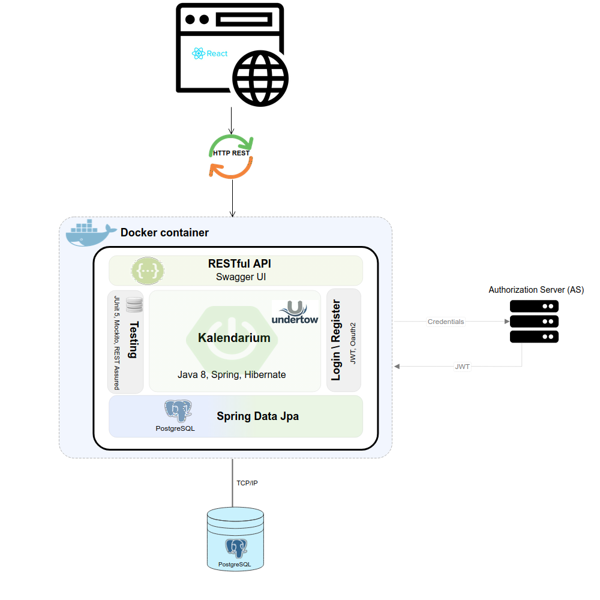

# Kalendarium

---

http://159.65.124.175:8080/apidoc

# Requirements  

The objective of Kalendarium is to offer users a platform on which they can make appointments to different activities.  

# Diagrams
_See [documents](documents) for all diagrams_

# Tools and technologies used

- **Diagrams:** [Moqup](https://app.moqups.com/)  
- **Backend:**  
    - Language: [Java](https://www.java.com/en/)
    - Editor: [IntelliJ IDEA](https://www.jetbrains.com/idea/)
- **Database:** PostgreSQL(https://www.postgresql.org/)

